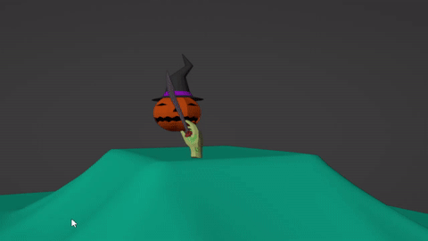
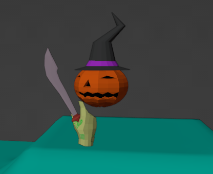

<h1 align="center"> Primeiro projeto com o blender </h1>

  
  
  

Meu primeiro projeto feito no blender, com o objetivo de recebimento de nota parcial na disciplina de Computação Gráfica no ano de 2021. O projeto é composto por uma abóbora, com chapéu de bruxa, que possui uma mão zombie segurando uma espada medieval. Abaixo o projeto finalizado:

  

  

## ✔️ Técnicas e tecnologias utilizadas

As técnicas e tecnologias utilizadas no projeto foram:

  

- `Blender`.

<h2 align="center">Autores</h2>

<table align="center">
  <tr>
    <td align="center">
      <a href="https://github.com/ANACAPELETTI">
         <b>Ana Capeletti</b>
      </a>  
      
    </td>
</table>
